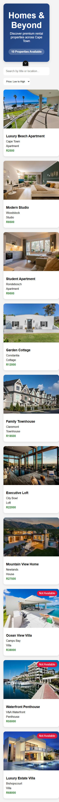

# Property Mini Listings

A lightweight Vue 3 + Vite property listing app that displays rental listings in a responsive card grid with search and price sorting.

## Project Overview

- Built with Vue 3 and Vite.
- Displays a collection of property cards with images, locations, types, and prices.
- Includes search filtering by title or location.
- Supports sort order by price (low-to-high, high-to-low).

## Installation

1. Open a terminal in the project folder.
2. Install dependencies:

```sh
npm install
```

> Recommended Node versions: `^22.18.0` or `>=24.12.0`

## Run Locally

Start the local Vite development server:

```sh
npm run dev
```

Then open the URL shown in the terminal, for example:

```sh
http://127.0.0.1:4173/
```

## Build for Production

```sh
npm run build
```

## Screenshot



## Notes

- The app is designed to work as a demo listing interface.
- You can extend it by adding real data, filtering options, or route-based views.
